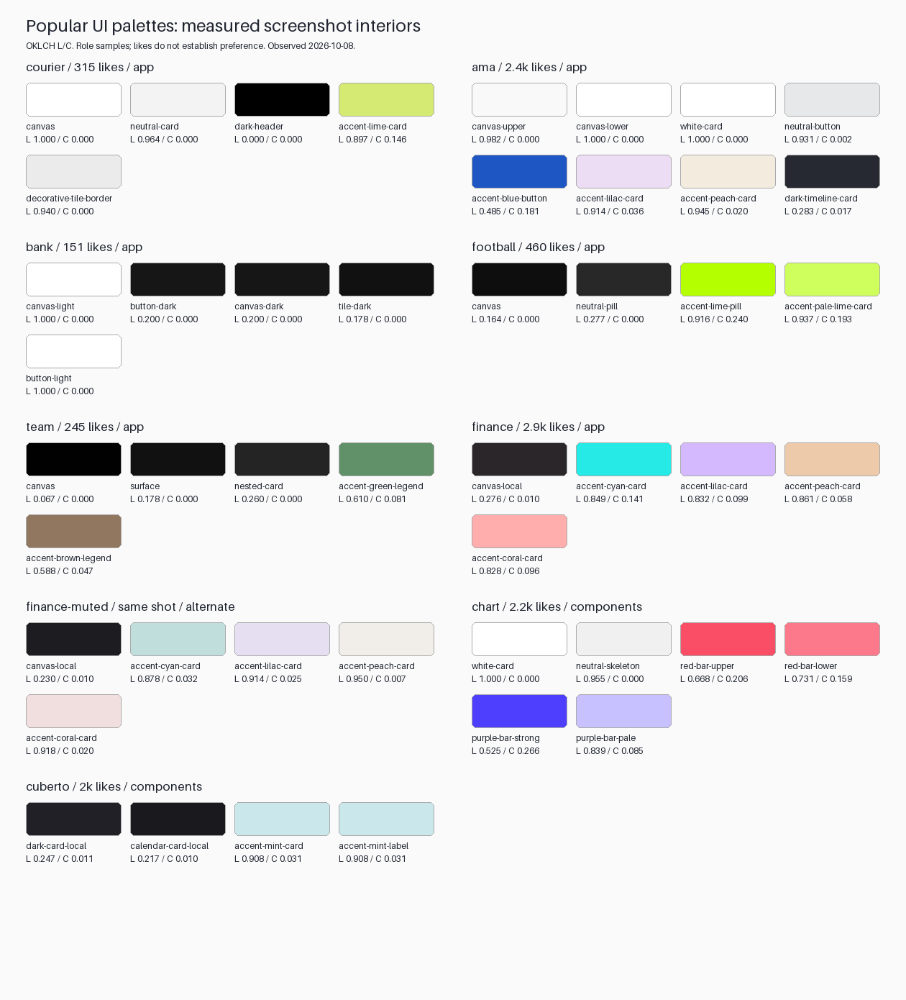

# UI color and contrast research

Updated: **2026-10-08**. Research started at **2026-10-08T13:23:47Z**. Status: measurement pass complete; role ranges encoded and applied to the computed theme. Preference claims remain hypotheses.

## Main findings

1. **Neutral hierarchy mostly changes lightness.** Sampled white app canvases have `L=0.982–1.000`, `C≈0`. Light neutral boxes either move down to `L≈0.93–0.96`, or remain white over a slightly darker canvas. Dark neutral boxes commonly move upward in `L`, but one banking example moves downward.
2. **Colored boxes change both axes.** Pastel cards often combine high `L` with reduced `C`. Strong buttons and charts use a different recipe. Multiple accents within one design do not share one exact chroma.
3. **Hue-independent role structure is useful; hue-independent guarantees are not.** Equal `L/C` can change WCAG contrast across hues. Available chroma also changes with hue and display gamut.
4. **Popularity describes a sample, not why people like it.** Preference studies support context and audience effects; they do not establish a universally preferred UI lightness/chroma interval.

## Goal

Measure popular Dribbble mobile interfaces with light and dark backgrounds in OKLCH. Separate canvas, raised surfaces, contained boxes, text, borders, and multiple accent roles. Identify which relationships transfer to AuraVibes independently of hue, and which require gamut or contrast checks for each hue.

This living record separates **observed screenshot values**, **computed mathematical results**, **normative requirements**, and **proposed design starting points**. Findings from publications are paraphrases. Research artifacts are documented below.

## Evidence plan

- [x] Record popularity filters, displayed order, titles, URLs, likes, and observation date.
- [x] Analyze both cases: three light app examples, five dark app examples including AMA onboarding; two component studies provide additional evidence.
- [x] Record rendered sRGB samples, coordinates, OKLCH conversion, and sampling uncertainty.
- [x] Compare lightness/chroma changes, multiple accents, neutral boxes, and an alternate palette.
- [x] Calculate 50 pair comparisons and distinguish text, graphics, borders, surface differences, and accent-family differences.
- [x] Review 18 primary sources on color math, accessibility, polarity, and preference.
- [x] Map findings to current AuraVibes math; preserve do/don't rules and open work.

## Measurement rules

- For token-like measurements, sample flat UI interiors. Analyze thin borders, glyphs, and gradients separately; exclude illustrations, shadows, and presentation backdrops.
- Treat rendered screenshot colors as observations, not exact original design tokens.
- Do not equate OKLCH lightness with WCAG relative luminance.
- Do not assume equal chroma gives equal saturation or works in the same gamut at every hue.
- Keep accessibility requirements independent of popularity and visual preference.
- Tag recommendations as measured, externally supported, or design hypotheses.

## Selection record, 2026-10-08

Observed sources: [Popular / Mobile / This Past Month](https://dribbble.com/shots/popular?tag=mobile&timeframe=month) and [Popular / Mobile / All Time](https://dribbble.com/shots/popular?tag=mobile&timeframe=ever). Saved first-page DOM records: [monthly feed](ui-color-contrast/monthly-feed.json), [all-time feed](ui-color-contrast/alltime-feed.json). Monthly feed contains 20 organic entries plus an advertisement; all-time snapshot contains 22 organic entries. These feeds are not strictly sorted by likes. Counts shown as `k` remain rounded strings.

| Shot / author | Observed likes | Selected evidence |
| --- | ---: | --- |
| [Finance Dark theme Design](https://dribbble.com/shots/18427655-Finance-Dark-theme-Design), Ghulam | 2.9k, all-time | Dark UI with cyan, lilac, peach, coral cards; alternate muted palette attached to same shot |
| [AMA. – Learning App User Interface](https://dribbble.com/shots/17575451-AMA-Learning-App-User-Interface), Tran Mau Tri Tam | 2.4k, all-time | Light content screens, blue CTA, lilac/peach boxes; dark onboarding |
| [Chart Cards](https://dribbble.com/shots/20454370-Chart-Cards), Michal Parulski / widelab | 2.2k, all-time | White components with red/purple chart families; gray presentation backdrop excluded |
| [UI Components Dark Theme](https://dribbble.com/shots/17578107-UI-Components-Dark-Theme), Ghulam / Cuberto | 2k, all-time | Dark components with mint cards/labels; black presentation backdrop excluded |
| [Football Mobile App](https://dribbble.com/shots/27759882-Football-Mobile-App-Sports-UI-Design), Nixtio | 460, month | Near-black UI, neutral pills, vivid and pale lime accents |
| [Courier Dashboard](https://dribbble.com/shots/27703402-Courier-Dashboard-Logistics-Delivery-App), Ronas IT | 315, month | White body, gray utility boxes, lime tracking card, black header |
| [Team Management](https://dribbble.com/shots/27744927-Team-Management-Employee-Analytics-Mobile-App), Nixtio | 245, month | Near-black canvas, nested neutral cards, green/brown chart markers |
| [Bank App UI UX Design](https://dribbble.com/shots/27732877-Bank-App-UI-UX-Design), theosm / Lalit Kumar | 151, month | Paired white/dark app screens, monochrome controls, darker dark-theme tiles |

This is a purposeful sample of **eight popular shots and nine attachments**, not eight highest-liked apps on the entire platform. Two shots are component presentations. Six individual designers/teams are represented; Ghulam and Nixtio each contribute two shots. Alternate Finance palette is not an independent popularity observation. All-time and monthly like totals are not directly comparable because exposure differs.

Excluded monthly logo/website/ad entries; Crypto Wallet and Formula Racing were inspected but omitted from quantitative extraction because presentation effects complicate flat surface sampling. Lower-liked controls and unsuccessful designs were not sampled, so this study cannot identify which palette properties distinguish popular from unpopular work.

## Reproducible method and uncertainty

**67 patches; 50 pair comparisons.** Source assets are URLs observed in shot-page image attributes. Downloaded PNG/JPEG files have no embedded ICC profile; this study assumes their untagged RGB is sRGB. It does not measure physical device luminance or recover original Figma tokens.

For flat interiors, use modal opaque RGB in small recorded rectangles. For glyph regions, exclude background through a recorded channel filter, then choose the modal foreground RGB. Store pixel coordinates, image dimensions, source URL, SHA-256, top three RGB frequencies, mode fraction, and selected-pixel lightness range. Hue is omitted below `C=0.001`; residual JPEG noise can still create misleading hue/chroma near black.

Flat patches often have mode fraction 1.0. Small labels can have fractions below 0.05 because of antialiasing, resampling, and JPEG variation. Their contrast numbers are **estimates**, not conformance verdicts. Local gradient/shaded samples are marked in metadata. Two graph samples describe positions along gradients, not authored endpoint tokens. Source uncertainty dominates additional decimal precision.

| Artifact | Purpose |
| --- | --- |
| [Measurement input](ui-color-contrast/samples-input.json) | Shot metadata, image URLs, exact rectangles, foreground filters, pair definitions |
| [Full measurements](ui-color-contrast/measurements.json) | RGB, OKLCH, luminance, checksums, uncertainty, pair metrics |
| [Samples CSV](ui-color-contrast/samples.csv) / [pairs CSV](ui-color-contrast/pairs.csv) | Analysis-ready numeric rows |
| [Full per-shot tables](ui-color-contrast/measurement-tables.md) | All 67 role samples and 50 pair comparisons |
| [Computed examples](ui-color-contrast/computed-examples.json) | Equal-L/C counterexamples and sampled gamut ceilings |
| [Measurement script](ui-color-contrast/measure.py) | Reproduces values, tables, and swatches; no network access |

Source images remain in ignored `build/color_research/2026-10-08/`. Reproduction requires matching assets, Python and Pillow 12.3+:

```sh
python3 docs/research/ui-color-contrast/measure.py build/color_research/2026-10-08
```

Script checks black/white contrast = 21, known red lightness, and inverse-transform round trips before extraction. These checks validate the research calculation, not the Flutter implementation.



## Case 1: white / near-white app backgrounds

Values below are **observed**; `L` uses 0–1, `C` is absolute OKLCH chroma, `h` is degrees. `C≈0` means neutral.

| UI role | RGB | L | C | h |
| --- | --- | ---: | ---: | ---: |
| Courier canvas | `#FFFFFF` | 1.0000 | ≈0 | — |
| Courier utility card | `#F3F3F3` | 0.9642 | ≈0 | — |
| Courier lime tracking card | `#D5EA73` | 0.8971 | 0.1464 | 117.7 |
| AMA upper canvas | `#F9F9F9` | 0.9821 | ≈0 | — |
| AMA mentor card | `#FFFFFF` | 1.0000 | ≈0 | — |
| AMA secondary button | `#E7E8E9` | 0.9305 | 0.0017 | 247.8 |
| AMA blue CTA | `#1E56C3` | 0.4855 | 0.1806 | 261.9 |
| AMA lilac card | `#ECDCF4` | 0.9145 | 0.0364 | 314.6 |
| AMA peach card | `#F3ECDE` | 0.9448 | 0.0201 | 84.6 |
| Bank light canvas | `#FFFFFF` | 1.0000 | ≈0 | — |
| Bank dark CTA | `#161616` | 0.2002 | ≈0 | — |

**Two workable neutral structures:** Courier places gray boxes on white (`ΔL=-0.0358`); AMA places white cards on near-white (`ΔL=+0.0179`) with shadows and layout supporting boundaries. Surface ratios are only 1.11 and 1.05 respectively. Not every box requires a 3:1 boundary: the accessibility rule concerns visual information essential to recognizing controls or graphics, not all decorative grouping. [W3C non-text contrast](https://www.w3.org/WAI/WCAG22/Understanding/non-text-contrast.html).

Courier's thin product-card border has a central rendered column `#EBEBEB` (`L≈0.940`, `C≈0`), about 1.19:1 against white. This is an antialiased stroke observation, not its original token. Borders serving essential recognition need stronger treatment than decorative grouping.

**Accent distinction:** AMA blue CTA has substantially lower `L` and higher `C` than its large pastel cards. White text on the sampled blue is 6.62:1. Courier instead uses a very light, fairly chromatic lime card with black text at 15.85:1. A single recipe for every colored fill would lose this role distinction.

**Reading lesson:** Bank’s sampled muted text `#A2A2A2` on white gives approximately 2.55:1; Chart Cards’ `#989898` gives 2.88:1. Neither sampled pair reaches normal-text 4.5:1. Courier’s tiny secondary-label estimate is 4.41:1, too close to the threshold and too uncertain for a categorical source-design verdict. Copying popular muted labels is not evidence of sufficient contrast.

## Case 2: dark app backgrounds

| UI role | RGB | L | C | h |
| --- | --- | ---: | ---: | ---: |
| Football canvas | `#0E0E0E` | 0.1638 | ≈0 | — |
| Football inactive pill | `#282828` | 0.2768 | ≈0 | — |
| Football active lime | `#B4FF00` | 0.9160 | 0.2397 | 128.1 |
| Football pale lime card | `#CFFF5D` | 0.9365 | 0.1927 | 124.2 |
| Team canvas | `#010101` | 0.0672 | ≈0 | — |
| Team panel | `#111111` | 0.1776 | ≈0 | — |
| Team nested card | `#242424` | 0.2603 | ≈0 | — |
| Team green marker | `#609168` | 0.6102 | 0.0814 | 148.7 |
| Team brown marker | `#917760` | 0.5879 | 0.0467 | 63.2 |
| Bank canvas | `#161616` | 0.2002 | ≈0 | — |
| Bank utility tile | `#111111` | 0.1776 | ≈0 | — |
| AMA onboarding canvas | `#191B22` | 0.2232 | 0.0140 | 272.7 |

Football separates neutral pills by `ΔL=+0.1131`, `ΔC≈0`. Team separates panel/canvas by `+0.1104`, then nested card/panel by `+0.0827`. Bank’s tiles move **downward** by `-0.0226`; icons, spacing, and labels supply most of their visibility. Dark cards can therefore be raised neutrals, darker wells, or bright accent containers.

Football’s bright lime requires dark ink: sampled black text gives 17.24:1; replacing it with white would give only 1.22:1. “Dark theme” does not mean white text on every element. Team’s green/brown markers give 5.17/4.51:1 against the sampled panel, despite modest chroma.

## Multiple accents, boxes, and same-family changes

### Finance: near-equal lightness, unequal chroma

The vivid Finance attachment places four different hues on a local dark canvas (`L=0.2757`, `C=0.0103`). All card interiors cluster around `L=0.83–0.86`; their chroma spans 0.058–0.141. Darkness of the surrounding UI does not require low-lightness accent cards.

| Card family | Vivid attachment L / C / h | Alternate attachment L / C / h | Alternate minus vivid ΔL / ΔC |
| --- | --- | --- | --- |
| Cyan | 0.8494 / 0.1407 / 192.6° | 0.8782 / 0.0318 / 191.7° | +0.0287 / −0.1089 |
| Lilac | 0.8324 / 0.0989 / 302.2° | 0.9145 / 0.0253 / 303.5° | +0.0821 / −0.0736 |
| Peach | 0.8608 / 0.0583 / 64.4° | 0.9500 / 0.0074 / 80.7° | +0.0892 / −0.0509 |
| Coral | 0.8283 / 0.0955 / 20.1° | 0.9181 / 0.0198 / 17.5° | +0.0898 / −0.0757 |

The alternate is lighter **and** less chromatic. Peach also changes hue materially; this is not a controlled constant-hue experiment. Lighting/presentation differs between attachments. The table describes rendered palette alternatives and cannot attribute the change to one design operation or user preference.

### Same family is not always one axis

| Comparison | ΔL | ΔC | Interpretation |
| --- | ---: | ---: | --- |
| Football pale lime relative to active lime | +0.0206 | −0.0470 | Mostly reduced chroma; slightly lighter; hue shifts ~4° |
| Chart lighter red region relative to darker region | +0.0631 | −0.0472 | Both lightness and chroma change along gradient |
| Chart pale purple segment relative to strong purple | +0.3144 | −0.1811 | Much lighter and less chromatic; hue shifts ~13° |
| Cuberto mint label relative to mint card | 0.0000 | 0.0000 | Same sampled color reused for two roles |

Cuberto mint is `L=0.9081`, `C=0.0310`: bright against dark components without high chroma. Chart strong purple is `L=0.5246`, `C=0.2659`: very different accent behavior. Pooling these into an “average popular chroma” would erase their role differences.

## Math: what transfers across hue

### Conversion and color distance

For an sRGB channel `u` normalized to 0–1:

```text
linear(u) = u / 12.92                     if u ≤ 0.04045
            ((u + 0.055) / 1.055)^2.4     otherwise

Oklab = M₂ · cube_root(M₁ · linear_sRGB)
C = sqrt(a² + b²)
h = atan2(b, a) in degrees

ΔL = L₂ − L₁
ΔC = C₂ − C₁
ΔEOK = sqrt(ΔL² + C₁² + C₂² − 2 C₁ C₂ cos(h₂ − h₁))
```

Matrices and inverse are pinned in the measurement script to [Ottosson’s 2021-01-25 matrix update](https://bottosson.github.io/posts/oklab/). `ΔL/ΔC` reveal which coordinates changed. `ΔEOK` also includes hue differences; it is not a text-contrast ratio.

When `C=0`, hue is undefined and changing hue changes nothing. This is the cleanest way to make neutral hierarchy independent of an accent picker. For nonzero chroma, perceptual coordinates remain useful, but screen-gamut boundaries and contrast depend on hue.

### Luminance contrast differs from perceptual lightness

```text
Y = 0.2126 Rlinear + 0.7152 Glinear + 0.0722 Blinear
WCAG ratio = (max(Y₁,Y₂) + 0.05) / (min(Y₁,Y₂) + 0.05)
```

WCAG 2.2 AA requires 4.5:1 for normal text, 3:1 for large text. Ratios are calculated on actual foreground/background output; `ΔL` alone cannot substitute. For neutrals only, `Y≈L³`. White text against a neutral fill therefore needs approximately `L≤0.5681` for 4.5:1. This bound does not extend unchanged to chromatic fills. [WCAG requirements](https://www.w3.org/TR/2024/REC-WCAG22-20241212/#contrast-minimum), [evaluation guidance](https://www.w3.org/WAI/WCAG22/Understanding/contrast-minimum.html).

Computed in-gamut counterexample, `L=0.57`, `C=0.08`, against white: hue 30° gives **4.630:1**, hue 200° gives **4.303:1**. Same L/C, different threshold outcome. Full six-hue table and derivation: [primary appendix](ui-color-contrast-primary-sources.md#equal-lightness-and-chroma-do-not-guarantee-equal-contrast).

### Chroma must fit the chosen gamut

Define `Cmax(L,h,G)` as largest chroma inside target RGB gamut `G`. Compare `ρ=C/Cmax` when nonzero; this is proximity to the gamut boundary, not a preference score or perceived saturation. [Primary gamut analysis](https://bottosson.github.io/posts/gamutclipping/).

Computed sRGB limits at `L=0.65`: hue 200° supports about `C=0.1105`; hue 330° supports `0.2963`. A requested `C=0.17` fits one and exceeds the other. Across a **1° hue grid**, minimum capacity is:

| L | Minimum sampled Cmax |
| ---: | ---: |
| 0.40 | 0.0680 |
| 0.65 | 0.1105 |
| 0.78 | 0.1110 |
| 0.90 | 0.0481 |
| 0.95 | 0.0236 |

These are computed grid samples, not a proof over every continuous hue. Very light all-hue pastels have little chroma headroom. A transferable recipe can start with `C=min(Crole, 0.95×Cmax(L,h,sRGB))`, then check actual RGB validity and contrast. The 0.95 margin is a **proposed engineering margin**, not a scientific preference constant.

Alpha/gradients also matter: compose in the renderer’s actual blending space, convert the resulting output to sRGB, then calculate contrast. Do not average OKLCH coordinates to simulate arbitrary transparency or test one gradient location and assume all locations pass. [CSS Color 4 compositing/interpolation context](https://www.w3.org/TR/2026/CRD-css-color-4-20261007/).

## What evidence explains about liking

The [primary-source appendix](ui-color-contrast-primary-sources.md) records publication dates, study details, limits, and 18 sources. Its preference evidence supports three distinctions:

- **Context changes ratings:** a liked isolated color is not automatically a liked object or UI fill. See [Schloss, Strauss, and Palmer](https://doi.org/10.1002/col.21756).
- **Audience matters:** British and Himba samples did not share a universal preference pattern. See [Taylor, Clifford, and Franklin](https://pubmed.ncbi.nlm.nih.gov/23148465/).
- **Harmony, pair liking, and foreground liking differ:** similarity can help harmony while contrast can help a foreground judgment. See [Schloss and Palmer](https://pubmed.ncbi.nlm.nih.gov/21264737/).

Reading performance is another outcome: two proofreading experiments favored positive display polarity, particularly at small character sizes. They establish no universal OKLCH surface band or prohibition on dark mode. [Polarity study](https://pubmed.ncbi.nlm.nih.gov/25135324/), [text-size study](https://pubmed.ncbi.nlm.nih.gov/25141597/).

**UI hypotheses to test:** neutral canvases may reduce competition with content; pastel containers may support grouping while strong accents direct attention; consistent role behavior may make scanning easier. The screenshots illustrate these structures, but they do not test these causal explanations. This study measures neither viewport accent area nor user preference/task performance. No 60/30/10 composition rule or universal chroma optimum follows from it.

## AuraVibes snapshot before implementation

The following table records the working tree before applying the ranges on 2026-10-08. Live implementations: [computed scheme](../../packages/auravibes_ui/lib/src/tokens/aura_computed_color_scheme.dart), [foreground search](../../packages/auravibes_ui/lib/src/colors/aura_brightness.dart), [conversion](../../packages/auravibes_ui/lib/src/colors/value_color.dart), [contrast helper](../../packages/auravibes_ui/lib/src/colors/color_contrast.dart). Main app and accent preview both instantiate the computed scheme.

| Previous role | Light L / requested C | Dark L / requested C | Evidence-based question |
| --- | --- | --- | --- |
| Canvas | 0.94 / 0 | 0.15 / 0 | Light canvas is darker than sampled white cases; dark value near Football |
| Surface | 0.98 / 0 | 0.18 / 0 | Light raised-white structure is plausible; dark canvas gap only 0.03 |
| Surface variant | 0.96 / 0 | 0.22 / 0 | Need distinguish grouping, raised panels, and interaction state |
| Primary/secondary/tertiary | 0.40 / 0.17 | 0.78 / 0.17 | One brand-fill recipe spans roles and hues; actual C varies after gamut check |
| Brand variant | 0.30 / 0.15 | 0.68 / 0.15 | Variant always lowers L; no separate pastel-container role |
| Semantic colors | 0.30 / 0.20 | 0.82 / 0.20 | Foreground/background use needs separate contrast checks |

The previous `_computedColor` lowered chroma in 0.01 steps until linear sRGB was valid. Requested chroma therefore differed from realized chroma. Using the research transform to approximate that loop at hue 180°: light primary `L=0.40,Crequested=0.17` became about `C=0.07`; dark primary `L=0.78` became about `C=0.14`. This is a mathematical approximation, not a captured Flutter output. A dark-looking accent can result from low L and gamut reduction together; increasing requested C alone may have no effect.

The previous foreground scanner required both its APCA target and WCAG ratio for passing candidates, with a strongest-contrast fallback. It searched fixed hue/chroma through L and conversion could clip out-of-gamut channels. Final rendered pairs need checks, including text/icons on variants, outlines, opacity, and interaction states.

**Discrepancy found and corrected during implementation:** previous `apcaLc` used WCAG piecewise luminance and scaled low contrast by 0.75. Published `apca-w3` 0.1.9 uses its own 2.4-exponent channel conversion and clips low contrast to zero. Tests reproduced both differences before correction. Six gray/chromatic reference pairs plus both low-contrast polarities now pass. The screenshot research tables continue to report WCAG ratios only. [Pinned published source](https://cdn.jsdelivr.net/npm/apca-w3@0.1.9/src/apca-w3.js), SHA-256 `7980633564cc5749aad608f163ad1a015af57f573729af2ea081034458ab79fe`.

The Oklab ±0.4 a/b bounds described in `value_color.dart` are not a sufficient sRGB gamut test. The scheme’s actual linear-RGB validity check is the relevant boundary test.

### Role bands used for the theme experiment

These are **proposals**, informed by this sample; they are not preferred-value estimates, required standards, or guaranteed all-hue colors.

| Role | White case starting point | Dark case starting point |
| --- | --- | --- |
| Neutral canvas | L 0.98–1.00, C 0 | L 0.16–0.24, C 0; near-black is a separate tested alternative |
| Neutral contained group | L 0.94–0.97 on white, or white on lower-L canvas | L 0.24–0.30, usually +0.04–0.12 over parent; darker wells separate role |
| Pastel colored container | L 0.89–0.95, desired C 0.02–0.08, gamut-capped | L 0.83–0.95, desired C 0.02–0.14, gamut-capped; dark ink |
| Strong colored action/chart | L 0.48–0.60 as trial band, per-hue C and foreground choice | Bright action or muted graphic are distinct recipes; examples range widely |
| Text | Solve contrast against actual role background | Solve contrast against actual role background and text size/weight |

White case has two observed choices: white canvas/gray grouping is simple and crisp; slightly gray canvas/white cards gives elevation with shadows. Choose based on actual chat/list task, not a claim that either convention universally wins. For chat, inspect canvas, user bubble, assistant bubble, composer, and selection separately; a “lighter” change means higher measured L relative to its parent.

## Code implementation, 2026-10-08

[AuraColorRange](../../packages/auravibes_ui/lib/src/colors/aura_color_range.dart) encodes the bands. `contains` validates L/C with a `1e-6` allowance for conversion round-off; this is not a contrast tolerance. `resolve` rejects targets outside the range, applies gamut mapping, and rejects an incompatible minimum chroma. The light-action C ceiling of 0.24 is an engineering choice; actual theme requests are lower.

`AuraComputedColor.gamutMapped` validates finite components, requires `0≤L≤1` and `C≥0`, and normalizes hue. In-gamut requests retain C. Out-of-gamut requests use 24 bisection steps over chroma, keeping L/hue fixed, followed by 5% headroom below the discovered boundary. Search upper bound is `min(Crequested,1)`, bounding precision for oversized requests. RGB channel bounds are checked before rendering; small inverse-matrix round-off at neutral white is allowed in tests.

| Applied role | Light L / requested C | Dark L / requested C |
| --- | --- | --- |
| Canvas | 0.99 / 0 | 0.20 / 0 |
| Surface | 0.97 / 0 | 0.26 / 0 |
| Surface variant | 0.95 / 0 | 0.30 / 0 |
| Primary / secondary / tertiary accent ink | 0.50 / 0.17 | 0.86 / 0.12 |
| Brand control fills (`fillFor`) | 0.80 / 0.24 | 0.86 / 0.24 |
| Brand variant | 0.48 / 0.15 | 0.83 / 0.10 |
| Semantic fills | 0.50 / 0.17 | 0.86 / 0.12 |
| Outline | 0.60 / 0 | 0.60 / 0 |
| Outline variant | 0.62 / 0 | 0.58 / 0 |

These are **authored targets**, not a log of realized per-hue chroma. Semantic hues retain `HueColorValues`. Brand/semantic requests use the range resolver; neutral roles use the same gamut mapper and their rendered range membership is checked in tests. The light structure chosen for this experiment is near-white canvas with darker gray grouping. Dark grouping rises above the charcoal canvas.

Brand controls now separate bright fills from accent ink. `AuraColorRange.actionFill` bounds L to 0.80–0.86 and requested C to 0.24; `AuraColorScheme.fillFor` preserves the selected brand hue and maps chroma to sRGB. `onFill` uses dark `neutral900` ink. Buttons, filled icon buttons, FABs, primary tiles, badges, and checked checkboxes use that pair. Inline text, outlines, semantic tints, and achromatic overrides keep their existing roles. App and Widgetbook defaults use violet at hue 300°; saved app hues are preserved. This default is an authored preference, not a result of the screenshot sample.

Widgetbook now builds `AuraComputedColorScheme` in both modes and exposes a 0–360° hue addon with 1° steps. Its previous static `AuraTheme` host was why computed palette changes did not appear there. The addon is applied inside the selected theme so changing hue preserves brightness. Golden-backed avatars retain their existing colors.

The first light-action target, `L=0.52`, failed 8-bit normal-text contrast at hue 136° on the gray surface variant: **4.481:1**. Target moved to 0.50; the test threshold stayed 4.5. The previous dark variant also failed the corrected APCA target, scoring approximately **Lc 44**. Shared brand foregrounds now solve against the darker dark-mode variant and are checked on both fills. Foreground candidates use gamut mapping, and contrast selection uses opaque 8-bit sRGB rather than only unquantized values. Generic `onColor` still documents a strongest-contrast fallback for impossible requested targets; the applied scheme's tested pairs meet both targets.

Light pastel containers have an explicit reusable recipe without changing the existing shared foreground contract for brand variants:

```dart
final card = AuraColorRange.lightPastel.resolve(
  hue: selectedHue,
  lightness: 0.92,
  chroma: 0.05,
);
final ink = card.onColor();
```

### Checks and remaining limits

- **203 focused UI/color tests pass** with Flutter 3.47.6 / Dart 3.13.5: 195 color/theme and affected-component checks, plus eight fill/inline button checks. Range boundaries cover every integer hue 0–359; theme text and bright-fill pairs cover 0–360, including hue wrap, both modes, all base brand roles, their variants, semantic foregrounds, muted text reuse, and accent text on neutral surfaces. Actual 8-bit pairs require WCAG ratio ≥4.5 and absolute APCA Lc ≥60. Control outline tokens require ≥3 on all three neutral backgrounds.
- Invalid components, oversized chroma, an impossible minimum chroma, preserved in-gamut requests, hue normalization, and black/white endpoints have regression checks. Numerical targets do not establish aesthetic preference or APCA font-size/weight suitability.
- Focused DCL rules/metrics pass. Pinned formatting passes. The import-sorter CLI does not support this workspace's package lockfile layout; its library was run on changed lists, then analyzer-required alphabetic package sections were restored.
- Root fatal analysis passes through `validate:quick`; root `format:check` passes after formatting the affected tile test. Final targeted fatal analysis of the color-role API and Widgetbook host also passes. Earlier test-style diagnostics were corrected in the touched tests.
- After merging `origin/main`, 141 app regressions pass across chat, workspace management, and hue persistence. Eleven Widgetbook hue/localization checks and 254 catalog/dashboard checks pass. Dashboard goldens match without regeneration.
- Light before/after captures and dark previews use the existing Chat, Workspaces, and Model screenshot fixtures on the same host/renderer. Capture roots: `build/color_review/ranges_before`, `ranges_light`, and `ranges_dark`. Dark capture adds `--dart-define=MARKETING_SCREENSHOT_DARK=true` to the existing capture command.
- All nine captures were visually reviewed. Light mode has a whiter canvas, gray groups, brighter teal actions, and stronger neutral outlines. Dark previews have charcoal canvas, raised gray groups, and bright mint actions with dark ink. Layout and copy remain the same; no earlier dark capture was used for comparison.
- Six final captures at hue 300° also pass and were reviewed: Chat, Workspaces, and Model in both modes. Roots: `build/color_review/final_light` and `final_dark`. They show violet controls with dark labels, readable purple accent ink, and neutral chat surfaces. Browser review also confirms the hue slider updates light/dark Widgetbook previews; local captures are under `build/color_review/widgetbook`.
- Full CI, real-device display calibration, font-specific APCA evaluation, composed alpha/disabled/selection states, and gradient worst cases remain outside this check. An integer hue grid is sampled coverage, not a proof for the continuous domain.

Re-run math checks from `packages/auravibes_ui`:

```sh
fvm flutter test test/src/colors test/src/tokens/aura_computed_color_scheme_test.dart --no-pub
```

## Do / don't record

| Do | Don't |
| --- | --- |
| Give canvas, neutral group, raised panel, colored container, action, and text separate roles. | Give every box one primary/variant recipe. |
| Use C=0 when neutral independence from accent hue is desired. | Assume changing hue can change a zero-chroma surface. |
| Adjust L for neutral hierarchy; adjust L and C deliberately for pastel variants. | Treat “lighter,” “less chromatic,” and “more transparent” as synonyms. |
| Log requested and rendered L/C/h after gamut mapping. | Assume C=0.17 is actually rendered at every hue. |
| Check foreground on every background it can occupy. | Assume white text works on a bright accent in dark mode. |
| Keep decorative surface differences separate from required control/graphic contrast. | Demand 3:1 between every card and its canvas. |
| Preserve labels/icons for meaning, state, and chart series. | Encode meaning solely through hue. |
| Report sampled ranges and audience limits. | Claim likes prove a palette caused popularity or usability. |
| Compare matched roles with actual typography/device conditions. | Treat ΔEOK, WCAG ratio, and APCA Lc as interchangeable. |

## Open work and maintenance

- [x] Correct APCA helper against pinned upstream reference values; font-size/weight evaluation remains separate.
- [x] Validate opaque rendered AuraVibes role ranges and text pairs over integer hues in both modes, including brand variants and neutral text reuse.
- [x] Apply one light structure and explicit dark surface roles; capture Chat, Workspaces, and Model with existing fixtures.
- [ ] Log realized per-hue values as a persistent dataset; check composed alpha/disabled/selection states and gradient worst cases.
- [ ] Evaluate typography and actual control/state cues on real devices; compare the alternate light structure with target users.
- [ ] If inferring preference, add matched comparison designs and target-user ratings plus reading/task measures. Analyze designers/exposure as confounders.
- [ ] If measuring accent area, mask actual UI viewport; exclude phone frames, photography, presentation backdrops, and shadows. Do not substitute total-image color percentages.

**Maintenance:** add each new observation with date, filter, URL, source checksum, role, and measurement method. Recompute tables instead of manually editing numeric rows. Mark claims observed/computed/normative/proposed. Preserve conflicting examples rather than forcing one palette rule. Revisit source versions when updating standards claims.

**Completion record:** source selection, extraction, source review, role-range implementation, theme application, and focused math/token checks completed. User preference experiments and the remaining rendering/typography checks above remain open.
