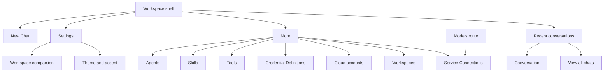

# Navigation, scope, and orientation

[Audit index](README.md) · [Consolidation proposal](08-screen-consolidation.md)

## User goal

Find the place to start a chat, configure its capabilities, or manage a workspace without first learning the application's internal object model. Know which workspace, account, agent, or conversation a change affects, and return to the unfinished task.

This goal is an audit assumption derived from the app's available tasks. No observed participant behavior is asserted.

## Current structure

Evidence: E01–E05 in the [evidence register](12-evidence-register.md). Desktop uses a persistent/collapsible sidebar and narrower widths use a drawer, with the app's desktop breakpoint at 960 logical pixels. Recent conversations and “View all chats” are existing navigation; history is not missing.

## Strengths to retain

- Workspace identity is present in the shell header; routes carry workspace IDs.
- Conversation selection has separate sidebar state instead of incorrectly highlighting New Chat.
- A full history screen complements the recent-chat list.
- Model and agent choices can be made in the composer, close to their effect.
- Models already redirects into Connections; this avoids another independent setup destination.
- Many child screens have localized titles and recognizable object actions.

## S05 — More

**Purpose:** dispatch to management areas. **Current success:** reaching a selected management screen. **Problem:** all seven areas have equal tile treatment, despite different scopes, frequency, and expertise requirements.

Keep the short explanatory subtitles as a useful pattern, but make them describe an outcome. The cloud-account tile uses the empty-account message as its subtitle regardless of actual account state. That can tell a signed-in person “No cloud accounts connected yet.” This is a source-confirmed copy mismatch, not an observed session failure.

**Disposition:** replace the hub with direct task destinations. Keep its old URL working during migration, showing a lightweight directory if a safe single redirect cannot preserve intent. Do not force all existing More links into one arbitrary default destination.

### UX-01 — A generic hub hides core setup and exposes advanced tasks too early

- **Task step/view:** starting AI setup, finding reusable behavior, or fixing a connection through S05.
- **Evidence:** E01 and E02; only New Chat, More, and Settings are shell items, while More contains seven management tiles, including credential schema authoring.
- **User problem and impact:** a person must guess what More contains before finding a provider, an agent, or a skill. The tile hierarchy gives no task sequence or expertise boundary.
- **Severity:** high. **Confidence:** medium; source structure is confirmed, discoverability impact is untested.
- **Change:** expose Chats, Agents & skills, and Connections. Put workspace management and cloud accounts in their relevant header/account context. Nest credential types under advanced Connections controls.
- **Preserve:** all existing objects, advanced authoring access, history, and compatibility links.
- **Verification:** give a new participant “Connect AI” and a returning participant “Fix the service used by this chat.” They should choose the right destination without opening unrelated areas. Compare against the current navigation; do not assume improvement from fewer tiles.

## S06 — Settings

**Purpose:** currently combines global appearance with workspace conversation behavior. **Current success:** a theme change or persisted compaction change. **Strength:** theme and compaction use their own controls, and compaction has validation and success/error copy.

**Disposition:** App settings contains theme, accent, and version. Workspace settings contains conversation-context policy and advanced model budgets. Entry points and titles must state the active workspace for workspace changes.

### UX-02 — App-wide and workspace-scoped settings are presented as one scope

- **Task step/view:** changing theme or conversation context policy in S06; managing identities through S05.
- **Evidence:** E03; `_SettingsBody` renders app appearance, `CompactionSettingsSection(workspaceId: ...)`, accent, and version together. E13 shows CloudAccountsScreen reads an app-wide account provider even though its URL sits under a workspace.
- **User problem and impact:** people can reasonably infer that every setting affects the selected workspace, or that all settings apply globally. This matters more for conversation behavior than for appearance.
- **Severity:** high. **Confidence:** medium.
- **Change:** separate App settings and Workspace settings; label the target workspace and account on management views. A unified settings shell is acceptable if scope is visibly separated and testable.
- **Preserve:** existing persistence boundaries. Moving navigation must not move records or make workspace policies global.
- **Verification:** with workspaces A and B, change appearance and then A's context policy. Ask which change will appear in B before switching. Check that their explanation matches actual persistence.

### UX-03 — Credential definitions lose their identity on arrival

- **Task step/view:** More → Credential Definitions → type list/create editor.
- **Evidence:** E02, E20, E21; the entry says “Credential Definitions,” but `skill_credentials_definitions.title`, `create_title`, and `edit_title` resolve to “Credentials,” “New Credential,” and “Edit Credential.” Saved skill credentials live in Connections.
- **User problem and impact:** a person trying to add a secret can enter schema authoring, or confuse creating fields with saving access values. The conceptual mistake can block skill setup.
- **Severity:** high. **Confidence:** medium.
- **Change:** use “Credential types,” “New credential type,” and “Edit credential type.” Explain “Defines the fields; does not store a login or API key.” Use “Saved credentials” for values.
- **Preserve:** shared definitions, field validation, references, and schema-conflict protection.
- **Verification:** ask a participant to add an API key to an existing skill and separately to define the fields for a new service. They should take different paths and explain the distinction.

### UX-04 — Integration identity and tool availability are managed in separate destinations

- **Task step/view:** configure/test an MCP connection in S15/S17, then inspect or enable tools in S18.
- **Evidence:** E14–E16; Connections has MCP status, authentication, test/reconnect actions, and catalog setup. Tools has grouped tools, manual MCP creation, and another reconnect control.
- **User problem and impact:** “the service is connected” and “its tools are available” are different outcomes with a weak visible relationship. Recovery can require switching destinations to locate the responsible service.
- **Severity:** medium. **Confidence:** medium.
- **Change:** place service identity/access and its exposed tools in one Connections area. Keep workspace tool defaults in a Tools view and link each service-provided group to its source connection.
- **Preserve:** native tools without a connection; skill/template tools; separate workspace, agent, and conversation permissions.
- **Verification:** disconnect one service, then ask the person why its tool cannot run. They should identify the source and reconnect without searching unrelated lists.

### UX-05 — Navigation establishes weak destination context and inconsistent task return

- **Task step/view:** entering a More descendant, switching shell destinations, or finishing a setup flow.
- **Evidence:** E01 uses shell-wide selected indexes and `goBranch(index, initialLocation: true)`. E07 uses different push/go setup entry paths. Cloud auth carries a returnPath, while connection creation has type/credential context but no explicit task return field.
- **User problem and impact:** the shell identifies More while a person is working on a specific capability; branch reset and mixed navigation patterns can make returning to an unfinished task hard to predict.
- **Severity:** medium. **Confidence:** medium for the information architecture; low for exact browser/back behavior until exercised.
- **Change:** expose the current destination and object, remember local list filters when appropriate, and define a task-origin return contract. State whether an editor applies a draft or saves data.
- **Preserve:** URL identity, workspace isolation, stack behavior, and unsaved-change protection. Do not replace every push/go mechanically.
- **Verification:** open a filtered skills list, edit an object, use browser/native Back, leave through the drawer, and return. Record actual history, draft, and filter behavior before choosing a reset policy.

## Proposed navigation contract

The full structure and route migration rules are in [08](08-screen-consolidation.md). Each destination must answer:

| Question | Required visible answer |
| --- | --- |
| Where am I? | Destination, object name, and meaningful subview title |
| What can I do here? | One short outcome statement, especially on first use |
| What does a change affect? | This app, this workspace, this agent, or this conversation |
| What is missing? | Named prerequisite and direct setup/recovery action |
| How do I finish? | Specific action noun plus visible result |
| How do I get back? | Parent/task return that preserves draft and filters where appropriate |

## Mobile and desktop checks

Use the same names and conceptual grouping at both widths. Desktop may expose Agents and Skills as children of Agents & skills. Mobile can use local tabs or grouped drawer entries; it should not replace meaningful labels with a generic More tab. The screen width can change the container, not the underlying scope or task.

The current responsive implementation is a strength, but its usability cannot be certified from source. Validate drawer dismissal, selected state, keyboard focus return, text scaling, and the 959/960 boundary with current captures.

## Implementation checkpoint

Task 2a replaces the primary More entry with Chats, Agents & skills and Connections. App settings and Cloud accounts are footer destinations. A shared header names the current workspace and Local/Cloud identity, and provides switching, Manage, Create, Connect cloud and Workspace settings. Old URLs remain; list routes are siblings instead of a forced More stack. Models remains an alias to AI providers.

App appearance/version and named workspace compaction are separated. Real routing tests cover selected destination, remembered list category across A/B/A, Chats restoration, one draft confirmation, meaningful direct/pushed Back and the 959/960 layout boundary. Policy tests cover A-only persistence and retained invalid/dirty buffers through refresh and failed writes. The strict scan and scoped review pass. [Execution evidence](14-execution-evidence.md#task-2a-verified-handoff) records commands and limits.

Task 2b is verified and reviewed. Related local views, retained query/filter/sort/page context, accurate credential-type names and relationship/source links pass their focused checks. The Tools repair consumes the connection Save result, refreshes names/permissions and retains expanded groups during loading. The final strict scan has zero diagnostics; review has zero open findings. [Task 2b handoff](14-execution-evidence.md#task-2b-verified-handoff) records exact evidence and limits.

Task 3 verifies first-use/auth return and app/account recovery behind a failed workspace. Task 4 verifies connection prerequisites, full-query draft protection and scoped retry/return recovery. Findings retain their remaining acceptance checks in [progress.md](progress.md). Current visual capture, real native interaction and participant comprehension are still unverified.

## Task 7 validation checkpoint

Actual production-route checks cover selected primary destinations, preserved aliases, workspace scope, older-history entry and retained contextual returns. Connections/Tools and Agents/Skills remain related views with distinct permission and object identities. The final source-frozen matrix and native/browser history results remain active; no first-click or comprehension result is inferred. See [current coverage](15-validation-coverage.md#current-implementation-evidence--task-7) and [execution evidence](14-execution-evidence.md#task-7-final-attempt-2-results-and-bounded-correction).
