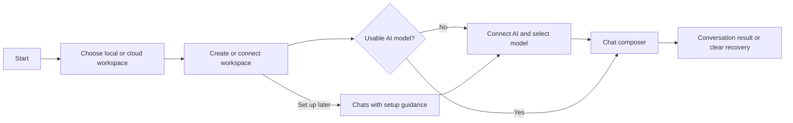

# Onboarding, chat, and AI activity

[Audit index](README.md) · Screens S01–S04 · Findings UX-06–UX-11

## Goals and assumptions

The first-use goal is to create or connect a workspace, connect a supported AI provider, select a usable model, and send a message. The returning-use goal is to find the right conversation, understand what is happening, and resolve any request for action. Optional agents and tools should be understandable without being prerequisites for ordinary chat.

These goals follow available product actions. Their frequency and relative importance have not been measured.

## Current first-use journey

| Step | View/state | Required information or decision | Action/transition | Completion/recovery | Health |
| --- | --- | --- | --- | --- | --- |
| 1 | Intro: welcome | Understand that context is organized by workspace | Continue | Move to workspace explanation | Explanatory overhead |
| 2 | Intro: workspace context | Another workspace explanation | Continue / Back | Move to creation choice | Could be combined with step 1 |
| 3 | Intro: workspace choice + shared form | Name, local target or an already connected account | Create workspace | Validation/loading/error in form | Local path present; cloud entry incomplete |
| 4 | Intro: ready | Decide Connect AI or Skip for now | Connect AI replaces route with provider creation; Skip opens New Chat | Workspace exists, but usable AI is not guaranteed | Readiness wording too broad |
| 5 | New connection: model provider | Provider/auth configuration | Test/connect/save | Specialized provider form and verification | Existing setup strengths |
| 6 | Return from provider setup | Continue original chat task | Intro-origin path pops to Connections; New-Chat-origin path pops back to New Chat | No shared explicit origin contract | At risk for first-task return |
| 7 | New Chat | Choose a model; optional agent/tools | Compose and send | Loading overlay; send error feedback | Needs visible readiness |
| 8 | Conversation | Read assistant response or resolve activity | Continue / approve / retry | Conversation status and controls | Backend result unverified |

Evidence: E06–E09. This is a source trace, not a record of executed steps. Successful provider authentication and first response were not observed.

## S01 — Intro

**Purpose and completion:** establish workspace context and create a workspace, then direct AI setup. **Strengths:** workspace organization is explained; local/cloud tradeoffs and possible future billing are mentioned; AI setup can be deferred; workspace validation is reused.

**Clarity risks:** two explanatory slides precede action; the cloud promise exceeds the actual first-run controls; “Ready to start” confirms workspace creation before usable chat is established. The choice slide embeds `CreateWorkspaceForm(onCreated: ...)` without `onAddCloudAccount`.

**Recommendation:** a short introduction with actionable Local / Cloud choices, then creation/authentication, then contextual AI readiness. Explain that skipping AI creates a workspace but leaves chat awaiting setup. Preserve cloud plan information at the decision point, without claiming a price or plan unavailable in source.

**States to verify:** first install with no accounts; existing account; existing workspace redirect; invalid name; account-provider load error; workspace creation failure; interrupted setup; provider authentication cancellation.

### UX-06 — First-run cloud choice has no matching account entry

- **Task step/view:** first install → Intro workspace choice.
- **Evidence:** E06 and E10; the embedded shared form has no add-account callback. With no accounts, its target dropdown contains Local workspace and its cloud action becomes a text hint. No Connect existing cloud workspace action is wired on this slide, despite the introductory cloud choice copy.
- **User problem and impact:** someone intending to start in cloud cannot follow that intent from the offered starting point. They must infer a local-first workaround or leave the flow.
- **Severity:** high. **Confidence:** medium; the missing entry is confirmed in source, actual abandonment is unknown.
- **Change:** make cloud authentication and existing workspace selection available before requiring a local workspace. Use an onboarding-owned auth context or equivalent entry that does not require a previously created workspace ID.
- **Preserve:** local-first setup, account selection, name validation, cloud capability checks, and context after authentication.
- **Verification:** from empty local state, complete both “Create cloud workspace” and “Connect existing cloud workspace” without creating a local workspace solely to unlock account navigation. Reject the recommendation if cloud-first is intentionally unsupported; in that case change the promise and explain the required local-first path.

### UX-07 — “Ready” and setup completion do not reliably mean ready to chat

- **Task step/view:** Intro ready → Connect AI → provider save.
- **Evidence:** E06 opens connection creation with `context.go`; E07's `_closeAfterSave` tries `maybePop` and falls back to Connections. E08 opens provider setup from New Chat with push. Intro copy says “Ready to start” after workspace creation.
- **User problem and impact:** the same setup task can finish in different destinations, and the user must infer the remaining model-selection/chat step. Workspace readiness, account access, and chat readiness are different states.
- **Severity:** high. **Confidence:** medium; source transitions are confirmed, full stack behavior needs live verification.
- **Change:** track the initiating task and show a success handoff: “AI connected. Choose a model to start chatting,” or “Ready to chat” only after a model is usable. Offer an explicit Continue to chat action.
- **Preserve:** push-origin returns to a skill/chat form, saved provider state, OAuth cancellation, and existing connection-list entry.
- **Verification:** complete provider setup from Intro, New Chat, Connections, and a skill credential request. Each should return to its correct task and show a truthful next step. Verify zero-model and failed-verification cases separately.

## S02 — New Chat

**Purpose and completion:** start a conversation in the active workspace. **Strengths:** workspace selector, model/agent selection, no-provider CTA, sending overlay, model-required hint, draft-aware workspace switching, and retry/focus handling are present.

The blank upper area is intentional when providers exist. The source only supplies the prominent setup prompt when the grouped model/provider result is empty. Do not report that all empty states or disabled reasons are missing: the composer already says when a model is not selected.

**Recommendation:** use the Chats landing state to explain readiness: model missing, provider disconnected, no usable models, or ready. Keep the composer central. Show agents and tools as optional customization, and provide a direct action for the current blocker.

### UX-08 — Readiness guidance is centered on “no providers,” not the full prerequisite state

- **Task step/view:** New Chat after connecting AI, with no selected/usable model or a catalog failure.
- **Evidence:** E08; `_hasNoModelProviders` uses the grouped model/provider data's emptiness, and the main prompt is gated by that boolean. The composer is disabled without `modelId` and has a model-required hint. E09 shows selector loading/error/recent-model states.
- **User problem and impact:** a person can see a disabled composer with a small selection hint while still needing to distinguish selection, unavailable models, and a failed connection/catalog.
- **Severity:** medium. **Confidence:** medium.
- **Change:** display one readiness summary with the next action appropriate to the reason. Avoid showing all setup tasks as a checklist when only a model selection is needed.
- **Preserve:** current disabled hint, recent models, model capabilities, specialized connection verification, and optional agent selection.
- **Verification:** test no provider, provider with no usable models, model unselected, selected model missing, loading, and catalog failure. Ask the person to explain what stops sending and what action resolves it.

### UX-09 — Workspace switching is easier to discover in New Chat than elsewhere

- **Task step/view:** switch context while reading a chat or configuring a skill.
- **Evidence:** E05 and E08; the drawer header renders the workspace name, while the interactive workspace selector lives in New Chat's app bar. More provides the separate manager.
- **User problem and impact:** a person may need to go to New Chat or management to change context, breaking the current task. This is a discoverability hypothesis, not evidence that switching is technically impossible.
- **Severity:** medium. **Confidence:** medium.
- **Change:** provide one consistent workspace selector in the shell header with Switch, Manage, and Create actions. Respect unsaved work and local/cloud availability.
- **Preserve:** the existing draft confirmation, failed-switch retry, focus restoration, and workspace-ID route scope.
- **Verification:** switch from a conversation and from a dirty editor. Cancellation must leave the exact current task intact; successful switching must visibly identify the new workspace and avoid showing the previous workspace's records.

## S03 — Chat history

**Purpose and completion:** find and reopen a workspace conversation. **Strengths:** View all is available in the sidebar; history has a New chat action; local archive import opens the imported conversation; cloud availability gates archive actions.

**Recommendation:** keep a complete history view. Reuse grouping, selection, labels, and lifecycle actions with recent chats, while allowing the full list to retain search and larger-history affordances. A shared list component or one Chats destination can reduce conceptual duplication without removing full history.

**Clarity/state checks:** no history versus no search result; local-only import explanation; title truncation; selected conversation semantics; pin/fork/rename/delete discoverability; import success or partial failure; unavailable cloud session.

There is no evidence here that the recent list and history should become one identical layout. The task and available space differ. Refer to UX-01, UX-05, and UX-32 for navigation and recovery.

## S04 — Conversation and sub-agent variant

**Purpose and completion:** continue the conversation, see progress, approve specific operations, and inspect results. **Strengths:** pending approvals, queued drafts, retry countdowns, model capability warnings, compaction, and delegated-agent status have dedicated controls. Approve once, approve for conversation, skip, and stop are separately represented.

**Recommendation:** make the active task and effective setup legible without exposing every technical detail at once. Keep approval details inspectable and consequential actions distinct. Connect parent and child activity explicitly.

### UX-10 — AI activity needs a single plain-language summary

- **Task step/view:** active conversation with queued drafts, tool approval, retry, or delegated work.
- **Evidence:** E11 and E24; status is composed from separate retry/queue/approval controls, with delegated status available through another widget.
- **User problem and impact:** the person may need to combine several pieces of state to understand whether the assistant is working, waiting for them, retrying, or finished.
- **Severity:** low. **Confidence:** low; source composition is confirmed, actual visual priority is unverified.
- **Change:** introduce a concise summary such as “Waiting for your approval” or “Working with 2 delegated agents,” with a relevant action. Keep detailed events in an activity view or expansion.
- **Preserve:** exact approval scopes, stop controls, queue editing, retry timing, and detailed tool arguments/results.
- **Verification:** show representative busy states and ask what is happening and whether action is required. Improve the summary only if it resolves misinterpretation without obscuring important pending actions.

### UX-11 — Child conversation needs explicit parent and read-only orientation

- **Task step/view:** open a delegated agent's conversation.
- **Evidence:** E04 validates workspace/parent relationships and opens ChatConversationScreen with `showInputComposer: false`. E11's app bar displays the conversation title. The route gate's missing/error state is addressed in UX-31.
- **User problem and impact:** removing the composer alone does not explain why input is absent or how the delegated run relates to the parent task.
- **Severity:** medium. **Confidence:** medium.
- **Change:** show “Delegated task from [parent chat]” and an explicit Return to parent chat action; explain that replies continue in the parent if that matches actual runtime policy.
- **Preserve:** child identity, parent checks, active state, approval behavior, and the intentionally absent composer.
- **Verification:** follow a child from the parent, then open its URL directly. The person should identify the parent, the child's status, and where they can continue the original conversation.

## Proposed first-message flow

This describes proposed behavior, not a new mandatory wizard. If a usable model already exists, go directly to the composer. If setup is deferred, keep the workspace usable and the missing prerequisite explicit.

## Implementation checkpoint

UX-09's shared workspace control is implemented and behavior-verified in Task 2a. New Chat no longer owns a second switching workflow. The production header uses the existing coordinator; real-route fixtures retain text, PDF/recording drafts and focus through cancellation and failed switches, then clean staged media only when successful navigation disposes that draft. [Execution evidence](14-execution-evidence.md#task-2a-verified-handoff) records the checks and approved review.

Task 3b2 verifies first-run local/cloud entry with zero workspaces, retained creation drafts, truthful model readiness, validated direct/pushed setup return, plain activity and child/parent/read-only orientation. After fresh review reproduced a pending-create owner loss and incorrect saved-provider selector guidance, fix round 1 passes 55 covering cases and final Intro 13/13. Scoped review approves both findings with zero open/new/deferred issues; final full-app analysis has zero diagnostics and all frozen hashes match. [First-use handoff](14-execution-evidence.md#task-3b2-verified-handoff) records actual commands, failures and reviewed contracts.

Workspace creation and AI configuration are separate outcomes. The provider-saved view guides Continue to chat to choose a model; New Chat points to its selector. Stored configuration remains distinct from remote access checked on send. Controlled cloud/model fixtures establish these paths, while current captures, native input, actual remote access and participant understanding still require their own evidence. The source findings above describe the original audited revision; current status is in [progress.md](progress.md).

## Task 7 validation checkpoint

The actual empty-local chain now creates a workspace, verifies/saves a controlled provider through encrypted storage, selects a model and persists the first user message in the intended conversation. Separate zero-account cloud and expired-account attachment chains use controlled protocol/endpoint boundaries. Older history, approval decisions and child-to-parent return execute against actual views. Live provider response, production email and participant understanding remain outside these results. See [current coverage](15-validation-coverage.md#current-implementation-evidence--task-7) and [execution evidence](14-execution-evidence.md#task-7-final-attempt-2-results-and-bounded-correction).
