# Screen consolidation and proposed information architecture

[Audit index](README.md) · [Inventory](01-screen-inventory.md) · [Roadmap](10-prioritized-roadmap.md)

## Recommended direction

Use three explicit work destinations: **Chats**, **Agents & skills**, and **Connections**. Put workspace switching/creation/management in the workspace header. Put app-wide appearance and cloud account management in their clearly scoped settings/account context. Workspace settings stays attached to the selected workspace.

This is a recommendation to validate, not an implemented redesign. The aim is fewer ambiguous destinations and clearer relationships. Route count, click count, and compactness are secondary to completing a task with adequate context and control.

## Proposed structure

```mermaid
flowchart TD
  App[AuraVibes] --> Workspace[Workspace selector]
  Workspace --> Switch[Switch workspace]
  Workspace --> Manage[Manage workspaces]
  Workspace --> Create[Create or connect workspace]
  Workspace --> WorkspaceSettings[Workspace settings]
  App --> Chats[Chats]
  Chats --> New[New chat and setup readiness]
  Chats --> History[History and recent chats]
  Chats --> Conversation[Conversation]
  Conversation --> LocalControls[This chat: agent, skills, tools, approvals]
  Conversation --> Children[Delegated task details]
  App --> Reusable[Agents and skills]
  Reusable --> Agents[Agents list and details]
  Reusable --> Skills[Skills list and details]
  Skills --> Authoring[Instructions, resources, template tools]
  App --> Connections[Connections]
  Connections --> Providers[AI providers and models]
  Connections --> Services[Services and MCP]
  Connections --> Tools[Workspace tools and defaults]
  Connections --> Credentials[Saved credentials]
  Credentials --> Types[Advanced: credential types]
  App --> Account[Cloud accounts]
  Account --> Auth[Login, registration, recovery]
  App --> AppSettings[App settings]
  AppSettings --> Appearance[Theme, accent, version]
```

Keep Workspace, Cloud accounts, and App settings visually distinct from workspace-specific content. Cloud account management may be reachable from the workspace selector's Connect flow as well as an account menu. Navigation changes do not imply that account storage or workspace data moves.

## Destination contracts

| Destination | The person comes here to… | Default action | Context that must stay visible | Secondary views |
| --- | --- | --- | --- | --- |
| Chats | Start/continue work and understand AI results | New chat / continue selected chat | Workspace; selected conversation; model/agent when relevant | Full history; activity; delegated task details |
| Agents & skills | Reuse assistant behavior and capabilities | Choose Agents or Skills view | Workspace; object ownership; enabled/readiness state | Focused details and child editors |
| Connections | Connect/repair AI and service access, inspect available actions | Connect AI/service, or fix Needs attention | Workspace; service identity; verified health | AI providers; Services; Tools; Saved credentials; advanced types |
| Manage workspaces | Open, create, connect, or administer workspace context | Open workspace | Local/cloud; connected account; active state | Connect cloud; details/members; lifecycle actions |
| Workspace settings | Change the selected workspace's conversation policies | Adjust policy | Workspace name and scope | Advanced context budgets |
| Cloud accounts | Add/reconnect/manage app identities | Log in/add account | Service/account and linked workspaces | Verification; reset; removal/deletion |
| App settings | Change appearance and inspect app information | Theme/accent change | Applies to this app | Version/about |

## Merge/group/keep matrix

| Existing surfaces | Decision | Proposed destination/behavior | Why | What must remain separate | Finding |
| --- | --- | --- | --- | --- | --- |
| More and all its navigation tiles | Replace hub | Direct destinations and contextual workspace/account actions | Labels should identify tasks without an extra generic choice | Compatibility entry for old links | UX-01 |
| Agents list + Skills list | Group | Agents & skills with separate lists/tabs | Reusable behavior depends on capabilities and benefits from shared context | Different objects, permissions, filters, pagination, and ownership | UX-21 |
| Connections + workspace Tools | Group | Connections area with Tools view and source links | Connect/test/enable/recover belongs to a related lifecycle | Connection health versus tool policy; native/skill tools without a connection | UX-04 |
| Catalog MCP + manual MCP setup | Shared entry/workflow shell | Connect service; catalog default plus Custom endpoint advanced option | One place to establish access and inspect result | Catalog metadata, manual fields, auth/transport modes, verification | UX-04, UX-19 |
| Credential Definitions + credential-related Connections | Nest | Saved credentials → Credential types, with contextual creation | Values and schema are related but different expertise levels | Schema versus secret values; dependency enforcement | UX-03, UX-18, UX-29 |
| Cloud account chooser + Login/Register entries | Remove interstitial/share shell | Login default; Create account alternative; context explanation | The chooser repeats links already on auth screens | Registration code and password recovery as focused states | UX-14, UX-15 |
| Intro welcome + workspace explanation | Combine explanation | Short first-use introduction near actionable creation | Two purely explanatory transitions can be deferred | Local/cloud choice and tradeoffs | UX-06, UX-07 |
| New Chat + Chats landing | One conceptual destination | Chats with empty/new state and history | Starting and continuing conversation are the same work area | Conversation identity and full-history utility | UX-01, UX-08 |
| Recent chats + full history | Share patterns; keep both views | Recent list plus full History | Different space and retrieval needs | Full list search/lifecycle/import behaviors | UX-05 |
| App appearance + workspace compaction | Split scope | App settings and Workspace settings | Different persistence and consequences | Existing policy data and advanced model budgets | UX-02 |
| Workspace management + cloud discovery | Keep manager; isolate subtask | Open workspaces default; Connect cloud secondary | Opening, connecting, and administering are different steps | Local/connected/available identity and account | UX-12 |
| Workspace creation in Intro and later creation | Reuse complete flow | Same task rules and shared form, different surrounding context | Behavior should agree, including cloud entry and return | First-use versus existing workspace context | UX-06, UX-25 |
| Agent create + edit | Already shared | Keep AgentDetailScreen modes | Reuse is already present | Create completion versus update result | UX-22 |
| Skill create + edit/view | Already shared | Keep detail with staged authoring | Built-in read-only and custom edit differ | Ownership and child identity | UX-23 |
| Resource create + edit/view | Already shared | Keep child editor with guard | Focused content task; existing reuse | Read-only built-in content | UX-25, UX-27 |
| Tool create + edit | Already shared | Keep advanced tool editor | Request/input design needs space | Preview versus execution, route guard | UX-28 |
| Credential type create + edit | Already shared | Keep advanced type editor | Shared schema dependencies need explicit handling | Types and saved values | UX-29 |
| Markdown editor + parent form | Keep, clarify draft boundary | Apply field changes, then save object | Shared rich-text editing is useful | Parent persistence and dirty state | UX-26 |
| Conversation skills + management Skills | Keep contextual picker | This chat's skill action and readiness | The person is using a capability, not authoring it | Add/Use now and context readiness | UX-24 |
| Conversation tools + workspace Tools | Keep scoped controls | This chat override panel with source/effective policy | Same tool identity; different scope | Workspace/agent/conversation policy and cloud support | UX-30 |
| Parent conversation + delegated conversation | Keep relation and navigation | Child detail with parent return | Delegated task identity is meaningful | Read-only policy, execution, approvals | UX-11 |
| Account management + workspace members | Keep separate objects | Account menu versus workspace detail | Identity removal/deletion affects different resources | Ownership and member role consequences | UX-13, UX-16 |
| Models route + Connections | Already consolidated | Preserve redirect; link to AI providers view after migration | No independent Models screen remains | Provider setup and in-chat model selector | E04 |

## Decisions considered and rejected

### A single settings page for everything

This could reduce destination count but would combine chat customization, appearance, accounts, service authentication, schema authoring, and cloud administration. It would enlarge the scope ambiguity found in UX-02. Use separate scope and task areas.

### A single list of agents, skills, and tools

They serve different decisions. A skill can be reused by several agents; tools may be native, connected, or skill-defined. A mixed list needs explanatory type labels and many irrelevant actions. Share navigation and dependency links, retain object-specific lists.

### Removing all child editing routes

Rich Markdown, HTTP templates, nested input schemas, and credential fields are substantial editing tasks. Modal-only authoring can weaken navigation recovery and leave the parent state unclear. Retain focused editing space, compatible identity, and explicit draft/persistence boundaries.

### Merging cloud login, registration, and reset into one visible form

These tasks need different fields and failure recovery. Share the shell and context, but show one active task and its progress. Removing a chooser does not remove required verification.

## Before/after scenarios

The following are proposed task routes, not measured savings. Actual steps depend on initial state and authentication.

| Scenario | Current source path | Proposed path | Expected observable improvement |
| --- | --- | --- | --- |
| Connect AI for first chat | Intro → provider create → Connections → return to chat/select model | Workspace creation → Connect AI → choose model → Chats | Explicit next step and task return |
| Fix a tool's service | Tools or Connections → find same MCP identity → reconnect → inspect tools | Tool source link → connection detail → reconnect → exposed tools | Correct recovery owner visible |
| Create an agent using a skill | More → Agents → skill manager; separate More → Skills for skill setup | Agents & skills → Agent → linked skill/readiness | Dependency relation clear without object duplication |
| Add a custom credential with no type | Connections → new credential → prerequisite message → More → definitions → return manually | Credential setup → Create type → resume same credential/skill | Prerequisite action and draft return |
| Connect existing cloud workspace at first use | Intro cloud promise → local-only workaround → account setup → manager | Cloud choice → auth → accessible workspace → connect/open | Offered task is actually reachable |
| Adjust conversation context policy | Settings alongside theme/accent → infer scope | Workspace menu → Workspace settings → Context management | Correct target named before change |

## Route and migration rules

Treat path names as an implementation proposal. UX grouping can be introduced while old paths remain valid; do not couple the first navigation improvement to a wholesale router rewrite.

1. Keep workspace IDs, conversation IDs, agent/skill IDs, connection IDs, account IDs, and parent/child checks unchanged.
2. Preserve existing `/more/models` redirect. If an AI providers subview is introduced, redirect to that subview without discarding the workspace.
3. Give each old More descendant an intentional mapping. The old `/more` hub can remain a compatibility directory rather than choose an unrelated destination.
4. Preserve type, credentialDefinitionId, appSkillId, and cloud returnPath context. Adding a new task return contract must validate internal destinations and retain origin identity safely.
5. Preserve deep links to details and editors; migrate child route relations before retiring old paths.
6. Test browser Back/Forward, native Back, direct entry, shell selection, workspace switching, and all dirty exits. Keep valid old URLs functional during transition.
7. Keep cloud unsupported actions and role restrictions enforced; a new tab or header must not expose a forbidden capability.
8. Do not migrate database/schema ownership merely because navigation changes. This proposal changes presentation and task paths first.

## Open decisions to resolve with evidence

| Decision | Current recommendation | What could change it |
| --- | --- | --- |
| Agents and Skills grouped versus separate primary links | Group under explicit Agents & skills | Frequent expert switching or failed first-click tests may justify separate direct links |
| Connections local tabs | AI providers, Services, Tools, Saved credentials | Card sorting/task testing may favor a type overview with facets; do not add a generic hub solely for symmetry |
| Workspace manager's cloud discovery | Secondary Connect view | Strong daily cloud discovery usage could warrant a visible sibling tab |
| Credential types location | Nested advanced access | If all intended users author schemas daily, retain more prominent access but still distinguish values |
| Child editor container | Rich editors stay focused | Live small-screen/keyboard tests may support a sheet for short edits, with same behavior |

No persona, usage frequency, or conversion metric was invented to settle these decisions. The [validation plan](11-validation-plan.md) supplies the comparison tasks.

## Implementation checkpoint

| Consolidation | Implementation status | Remaining evidence/work |
| --- | --- | --- |
| Explicit primary destinations replacing More | Verified in Task 2; compatibility More URL retained | Current visual/native/participant checks |
| Shared workspace control | Verified in Task 2a; New Chat duplicate workflow removed | Task 3a cloud/discovery behavior verified; current captures/native/comprehension |
| App versus workspace settings | Verified in Task 2a; one guarded named policy editor added | Failed-workspace account/auth reachability verified in Task 3b1; captures/native/comprehension |
| Agents/Skills and Connections/Tools views | Verified in Task 2b with retained state and reciprocal/source links | Current captures/native/comprehension; final shared error-state validation |
| Credential types under saved credentials | Verified in Tasks 2b/4/6: accurate names, exact prerequisite return, visible dependencies and authoritative mutation safety | Final captures/joined tasks/native/comprehension |
| Shared default authentication entry | Verified in Task 3b1; existing auth URLs wrap callback-owned content | Zero-workspace integration verified in Task 3b2; captures/native/comprehension and real delivery blocker |
| Workspace management and discovery | Verified in Task 3a; Open is default and Connect is a distinct view | Exact-account recovery verified with controlled Task 3b1 fixtures; current captures/native/comprehension and live services |
| Focused rich editors | Retained; shared draft/identity, contextual Markdown/resource/preview clarity and credential dependency safety verified | Final captures/joined tasks/native/comprehension |

[Execution evidence](14-execution-evidence.md) records verified changes; [progress.md](progress.md) keeps every unfinished item open. Adding Workspace settings gives policy editing a clear scope while related management lists share navigation. Screen-count reduction alone remains an inadequate acceptance condition.

## Task 7 validation checkpoint

Current implementation preserves focused object editors while consolidating primary management entry and related list views. All 35 typed endpoints remain covered, including old aliases; new workspace-policy scope and the shared auth wrapper bring the implementation inventory to29 screens. Actual joined tasks now connect setup, authoring and source repair. This validates mechanical task paths; screen-count reduction and participant preference are not claimed. See [current coverage](15-validation-coverage.md#current-implementation-evidence--task-7) and [execution evidence](14-execution-evidence.md#task-7-final-attempt-2-results-and-bounded-correction).
